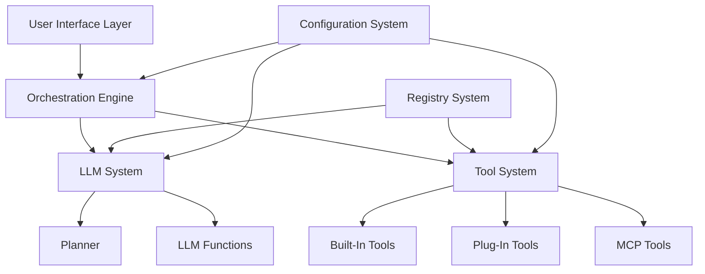

# AI 에이전트 프레임워크 설계 문서

## 개요

AI 에이전트 프레임워크는 확장 가능한 [계획-실행] 구조의 오케스트레이션을 통해 다양한 도메인 특화 에이전트를 개발할 수 있는 플랫폼입니다. 고정된 오케스트레이션 구조와 5가지 튜닝 요소를 통해 우아한 확장성을 제공하며, 메타 프로그래밍과 Registry 패턴을 활용한 플러그인 아키텍처를 구현합니다.

## 아키텍처

### 전체 시스템 아키텍처



### 계층별 아키텍처

1. **사용자 인터페이스 계층**: Web, Console, Application, API 인터페이스
2. **오케스트레이션 계층**: [계획-실행] 흐름 관리 및 제어
3. **LLM 시스템 계층**: 14가지 역할 기반 LLM 기능 제공
4. **도구 시스템 계층**: 3가지 유형의 도구 통합 관리
5. **레지스트리 계층**: 모든 확장 요소의 중앙 집중식 관리
6. **설정 관리 계층**: 구조화된 설정 및 프롬프트 관리

## 구성 요소 및 인터페이스

### 1. 오케스트레이션 엔진

#### 핵심 인터페이스
```csharp
public interface IOrchestrationEngine
{
    Task<IOrchestrationResult> ExecuteAsync(IUserRequest request);
    Task<IOrchestrationResult> ContinueAsync(IOrchestrationContext context);
}

public interface IOrchestrationContext
{
    string SessionId { get; }
    IUserRequest OriginalRequest { get; }
    List<IExecutionStep> ExecutionHistory { get; }
    Dictionary<string, object> SharedData { get; }
}

public interface IExecutionStep
{
    string StepId { get; }
    string StepType { get; } // "LLM" or "TOOL"
    string FunctionName { get; }
    object Input { get; }
    object Output { get; }
    DateTime ExecutedAt { get; }
    TimeSpan Duration { get; }
}
```

#### 실행 흐름 관리
```csharp
public class OrchestrationEngine : IOrchestrationEngine
{
    private readonly ILLMSystem _llmSystem;
    private readonly IToolSystem _toolSystem;
    private readonly IRegistry _registry;
    
    public async Task<IOrchestrationResult> ExecuteAsync(IUserRequest request)
    {
        var context = CreateContext(request);
        
        while (!context.IsCompleted)
        {
            // 1. LLM Plan 실행
            var planResult = await _llmSystem.ExecutePlannerAsync(context);
            
            // 2. 계획된 기능 실행
            foreach (var action in planResult.Actions)
            {
                if (action.Type == "LLM")
                {
                    var result = await _llmSystem.ExecuteFunctionAsync(action);
                    context.AddStep(result);
                }
                else if (action.Type == "TOOL")
                {
                    var result = await _toolSystem.ExecuteToolAsync(action);
                    context.AddStep(result);
                }
            }
            
            // 3. 완료 조건 확인
            context.IsCompleted = planResult.IsCompleted;
        }
        
        return CreateResult(context);
    }
}
```

### 2. LLM 시스템

#### LLM 기능 인터페이스
```csharp
public interface ILLMFunction
{
    string Role { get; }
    string Description { get; }
    Task<ILLMResult> ExecuteAsync(ILLMContext context);
}

public interface ILLMContext
{
    string Role { get; }
    Dictionary<string, object> Parameters { get; }
    IOrchestrationContext OrchestrationContext { get; }
}

public interface ILLMResult
{
    bool IsSuccess { get; }
    string ResponseType { get; } // "JSON", "TEXT", "COMPLETION"
    object Data { get; }
    bool IsCompleted { get; }
    List<IPlannedAction> NextActions { get; }
}
```

#### 14가지 LLM 기능 구현
```csharp
[LLMFunction("planner")]
public class PlannerFunction : ILLMFunction
{
    public string Role => "planner";
    public string Description => "사용자 요구 분석 및 실행 계획 수립";
    
    public async Task<ILLMResult> ExecuteAsync(ILLMContext context)
    {
        var prompt = await _promptManager.LoadPromptAsync("planner", context.Parameters);
        var response = await _llmProvider.GenerateAsync(prompt);
        return ParsePlannerResponse(response);
    }
}

[LLMFunction("interpreter")]
public class InterpreterFunction : ILLMFunction
{
    public string Role => "interpreter";
    public string Description => "입력 텍스트 의미 분석 및 핵심 정보 추출";
    
    // 구현...
}

// 나머지 12가지 기능들도 동일한 패턴으로 구현
```

#### 프롬프트 관리 시스템
```csharp
public interface IPromptManager
{
    Task<string> LoadPromptAsync(string role, Dictionary<string, object> parameters);
    Task<string> LoadPromptWithCacheAsync(string role, Dictionary<string, object> parameters, TimeSpan ttl);
}

public class PromptManager : IPromptManager
{
    private readonly IConfiguration _configuration;
    private readonly IMemoryCache _cache;
    
    public async Task<string> LoadPromptAsync(string role, Dictionary<string, object> parameters)
    {
        var templatePath = Path.Combine("prompts", $"{role}.md");
        var template = await File.ReadAllTextAsync(templatePath);
        
        // 치환 요소 처리
        foreach (var param in parameters)
        {
            template = template.Replace($"{{{param.Key}}}", param.Value?.ToString());
        }
        
        return template;
    }
}
```

#### LLM 모델 추상화
```csharp
public interface ILLMProvider
{
    Task<string> GenerateAsync(string prompt);
    Task<T> GenerateStructuredAsync<T>(string prompt) where T : class;
    Task<IAsyncEnumerable<string>> GenerateStreamAsync(string prompt);
}

public class LLMProviderFactory
{
    public ILLMProvider CreateProvider(string modelType, IConfiguration config)
    {
        return modelType switch
        {
            "openai" => new OpenAIProvider(config),
            "claude" => new ClaudeProvider(config),
            "local" => new LocalLLMProvider(config),
            _ => throw new NotSupportedException($"Model type {modelType} not supported")
        };
    }
}
```

### 3. 도구 시스템

#### 공통 도구 인터페이스
```csharp
public interface ITool
{
    string Name { get; }
    string Description { get; }
    IToolContract Contract { get; }
    Task<IToolResult> ExecuteAsync(IToolInput input);
}

public interface IToolContract
{
    string InputSchema { get; } // JSON Schema
    string OutputSchema { get; } // JSON Schema
    List<string> RequiredParameters { get; }
}

public interface IToolInput
{
    Dictionary<string, object> Parameters { get; }
    IOrchestrationContext Context { get; }
}

public interface IToolResult
{
    bool IsSuccess { get; }
    object Data { get; }
    string ErrorMessage { get; }
    Dictionary<string, object> Metadata { get; }
}
```

#### Built-In Tools 구현
```csharp
[BuiltInTool("embedding_cache")]
public class EmbeddingCacheTool : ITool
{
    public string Name => "embedding_cache";
    public string Description => "임베딩 벡터 캐싱 및 검색";
    
    public async Task<IToolResult> ExecuteAsync(IToolInput input)
    {
        // 임베딩 캐싱 로직 구현
        var text = input.Parameters["text"].ToString();
        var embedding = await GenerateEmbeddingAsync(text);
        await CacheEmbeddingAsync(text, embedding);
        
        return new ToolResult { IsSuccess = true, Data = embedding };
    }
}

[BuiltInTool("vector_db")]
public class VectorDBTool : ITool
{
    public string Name => "vector_db";
    public string Description => "벡터 데이터베이스 검색 및 RAG 기능";
    
    // 구현...
}
```

#### Plug-In Tools 시스템
```csharp
public interface IPluginTool : ITool
{
    string Version { get; }
    string Author { get; }
    List<string> Dependencies { get; }
}

[AttributeUsage(AttributeTargets.Class)]
public class PluginToolAttribute : Attribute
{
    public string Name { get; set; }
    public string Description { get; set; }
    public string Version { get; set; }
}

public class PluginLoader
{
    public async Task<List<IPluginTool>> LoadPluginsAsync(string pluginDirectory)
    {
        var plugins = new List<IPluginTool>();
        var dllFiles = Directory.GetFiles(pluginDirectory, "*.dll");
        
        foreach (var dllFile in dllFiles)
        {
            var assembly = Assembly.LoadFrom(dllFile);
            var pluginTypes = assembly.GetTypes()
                .Where(t => t.GetCustomAttribute<PluginToolAttribute>() != null)
                .Where(t => typeof(IPluginTool).IsAssignableFrom(t));
            
            foreach (var pluginType in pluginTypes)
            {
                var plugin = (IPluginTool)Activator.CreateInstance(pluginType);
                plugins.Add(plugin);
            }
        }
        
        return plugins;
    }
}
```

#### MCP Tools 시스템
```csharp
public interface IMCPTool : ITool
{
    string MCPVersion { get; }
    Task<bool> ConnectAsync(string endpoint);
    Task DisconnectAsync();
}

public class MCPToolAdapter : IMCPTool
{
    private readonly IMCPClient _mcpClient;
    
    public async Task<IToolResult> ExecuteAsync(IToolInput input)
    {
        var mcpRequest = new MCPRequest
        {
            Method = "tools/call",
            Params = new
            {
                name = Name,
                arguments = input.Parameters
            }
        };
        
        var mcpResponse = await _mcpClient.SendRequestAsync(mcpRequest);
        return ConvertMCPResponse(mcpResponse);
    }
}
```

### 4. Registry 시스템

#### 중앙 레지스트리
```csharp
public interface IRegistry
{
    void RegisterLLMFunction(ILLMFunction function);
    void RegisterTool(ITool tool);
    ILLMFunction GetLLMFunction(string role);
    ITool GetTool(string name);
    List<ILLMFunction> GetAllLLMFunctions();
    List<ITool> GetAllTools();
}

public class Registry : IRegistry
{
    private readonly Dictionary<string, ILLMFunction> _llmFunctions = new();
    private readonly Dictionary<string, ITool> _tools = new();
    
    public void RegisterLLMFunction(ILLMFunction function)
    {
        _llmFunctions[function.Role] = function;
    }
    
    public void RegisterTool(ITool tool)
    {
        _tools[tool.Name] = tool;
    }
    
    // 자동 등록 메커니즘
    public void AutoRegisterFromAssembly(Assembly assembly)
    {
        // LLM Functions 자동 등록
        var llmFunctionTypes = assembly.GetTypes()
            .Where(t => t.GetCustomAttribute<LLMFunctionAttribute>() != null)
            .Where(t => typeof(ILLMFunction).IsAssignableFrom(t));
        
        foreach (var type in llmFunctionTypes)
        {
            var function = (ILLMFunction)Activator.CreateInstance(type);
            RegisterLLMFunction(function);
        }
        
        // Tools 자동 등록
        var toolTypes = assembly.GetTypes()
            .Where(t => t.GetCustomAttribute<BuiltInToolAttribute>() != null)
            .Where(t => typeof(ITool).IsAssignableFrom(t));
        
        foreach (var type in toolTypes)
        {
            var tool = (ITool)Activator.CreateInstance(type);
            RegisterTool(tool);
        }
    }
}
```

### 5. 설정 관리 시스템

#### 설정 구조
```yaml
# config.yaml
llm:
  default_provider: "openai"
  models:
    planner: "gpt-4"
    interpreter: "gpt-3.5-turbo"
    summarizer: "claude-3-sonnet"
    generator: "gpt-4"
  
prompts:
  cache_ttl: "1h"
  template_directory: "./prompts"
  
tools:
  plugin_directory: "./plugins"
  mcp_endpoints:
    - name: "web_search"
      endpoint: "http://localhost:8080/mcp"
      
ui:
  interfaces:
    - "web"
    - "console"
    - "api"
```

#### 설정 관리 클래스
```csharp
public class ConfigurationManager
{
    private readonly IConfiguration _configuration;
    private readonly IMemoryCache _cache;
    
    public T GetSection<T>(string sectionName) where T : class
    {
        return _configuration.GetSection(sectionName).Get<T>();
    }
    
    public void ReloadConfiguration()
    {
        // 런타임 설정 재로드
        _cache.Clear();
        // 설정 파일 다시 로드
    }
}
```

## 데이터 모델

### 1. 실행 컨텍스트 모델
```csharp
public class OrchestrationContext : IOrchestrationContext
{
    public string SessionId { get; set; }
    public IUserRequest OriginalRequest { get; set; }
    public List<IExecutionStep> ExecutionHistory { get; set; } = new();
    public Dictionary<string, object> SharedData { get; set; } = new();
    public bool IsCompleted { get; set; }
    public DateTime StartedAt { get; set; }
    public DateTime? CompletedAt { get; set; }
}
```

### 2. 사용자 요청 모델
```csharp
public class UserRequest : IUserRequest
{
    public string RequestId { get; set; }
    public string UserId { get; set; }
    public string Content { get; set; }
    public Dictionary<string, object> Metadata { get; set; } = new();
    public DateTime RequestedAt { get; set; }
}
```

### 3. 실행 결과 모델
```csharp
public class OrchestrationResult : IOrchestrationResult
{
    public string SessionId { get; set; }
    public bool IsSuccess { get; set; }
    public string FinalResponse { get; set; }
    public List<IExecutionStep> ExecutionSteps { get; set; }
    public TimeSpan TotalDuration { get; set; }
    public Dictionary<string, object> Metadata { get; set; } = new();
}
```

## 오류 처리

### 1. 계층별 오류 처리 전략
```csharp
public class ErrorHandlingMiddleware
{
    public async Task<IOrchestrationResult> HandleAsync(
        Func<Task<IOrchestrationResult>> next,
        IOrchestrationContext context)
    {
        try
        {
            return await next();
        }
        catch (LLMException ex)
        {
            // LLM 관련 오류 처리
            return CreateErrorResult(ex, "LLM_ERROR");
        }
        catch (ToolException ex)
        {
            // Tool 관련 오류 처리
            return CreateErrorResult(ex, "TOOL_ERROR");
        }
        catch (Exception ex)
        {
            // 일반 오류 처리
            return CreateErrorResult(ex, "SYSTEM_ERROR");
        }
    }
}
```

### 2. 오류 격리 및 복구
```csharp
public class FaultTolerantExecutor
{
    public async Task<IToolResult> ExecuteWithFallbackAsync(ITool tool, IToolInput input)
    {
        try
        {
            return await tool.ExecuteAsync(input);
        }
        catch (Exception ex)
        {
            // 오류 로깅
            _logger.LogError(ex, "Tool execution failed: {ToolName}", tool.Name);
            
            // 대체 도구 실행 또는 기본값 반환
            return CreateFallbackResult(tool.Name, ex);
        }
    }
}
```

## 테스트 전략

### 1. 단위 테스트
- 각 LLM 기능의 독립적 테스트
- 각 도구의 입출력 검증
- 프롬프트 템플릿 치환 테스트

### 2. 통합 테스트
- 오케스트레이션 엔진의 전체 흐름 테스트
- LLM과 도구 간의 상호작용 테스트
- 플러그인 로딩 및 실행 테스트

### 3. 성능 테스트
- 대량 요청 처리 성능 테스트
- 메모리 사용량 및 캐싱 효율성 테스트
- 플러그인 로딩 시간 측정

### 4. 확장성 테스트
```csharp
[Test]
public async Task Should_Load_And_Execute_Plugin_Tools()
{
    // Given
    var pluginLoader = new PluginLoader();
    var plugins = await pluginLoader.LoadPluginsAsync("./test-plugins");
    
    // When
    var registry = new Registry();
    foreach (var plugin in plugins)
    {
        registry.RegisterTool(plugin);
    }
    
    // Then
    Assert.That(registry.GetAllTools().Count, Is.GreaterThan(0));
}
```

이 설계 문서는 AI 에이전트 프레임워크의 핵심 아키텍처와 구현 방향을 제시합니다. 메타 프로그래밍과 Registry 패턴을 활용한 확장성, 표준화된 인터페이스를 통한 일관성, 그리고 우아한 오류 처리를 통해 견고하고 확장 가능한 시스템을 구축할 수 있습니다.