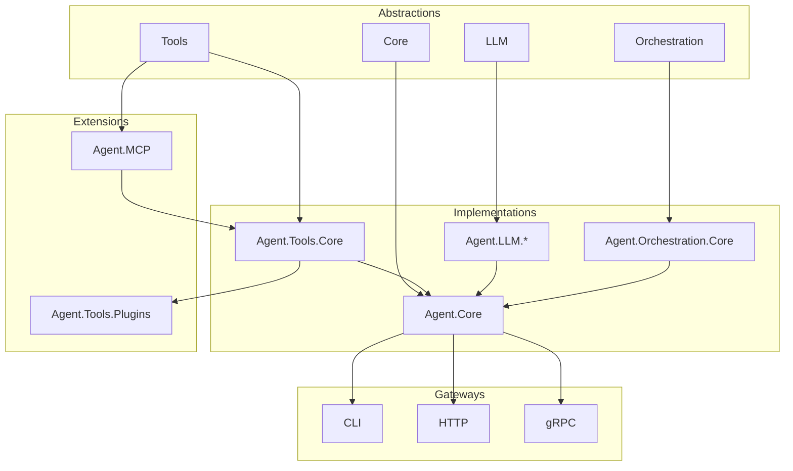

# 📂 **AI Agent Framework - 프로젝트 구조**

## 1. **전체 솔루션 구조**

```
AgentFramework.sln
├── src/
│   ├── Abstractions/           # 추상화 계층
│   ├── Core/                   # 핵심 구현
│   ├── Tools/                  # 도구 관련
│   ├── LLM/                    # LLM 관련
│   ├── Orchestration/          # 오케스트레이션
│   ├── MCP/                    # MCP 통합
│   └── Gateway/                # 진입점
├── tests/                       # 테스트
├── samples/                     # 예제
├── configs/                     # 설정 파일
├── docs/                        # 문서
└── scripts/                     # 빌드/배포 스크립트
```

## 2. **상세 프로젝트 구조**

### 📦 **Abstractions (추상화 계층)**

```
src/Abstractions/
├── Agent.Abstractions.Core/              # ✅ 완료
│   ├── Agents/
│   │   └── IAgent.cs
│   ├── Common/
│   │   ├── Identifiers/                  # RunId, StepId, AgentId, ToolId
│   │   └── Exceptions/
│   ├── Memory/
│   │   ├── IMemoryManager.cs
│   │   └── MemoryContext.cs
│   ├── Schema/
│   │   ├── Registry/ISchemaRegistry.cs
│   │   └── Validation/ISchemaValidator.cs
│   └── Streaming/
│       ├── Chunks/                       # StreamChunk 및 파생 타입들
│       └── Processing/
│
├── Agent.Abstractions.Tools/             # ✅ 완료 + 🆕 추가 필요
│   ├── Core/
│   │   ├── ITool.cs                      # ✅
│   │   └── IStreamingTool.cs             # ✅
│   ├── Registry/
│   │   └── IToolRegistry.cs              # ✅
│   ├── Loading/                          # 🆕 추가 필요
│   │   └── IToolLoader.cs
│   ├── Configuration/                    # 🆕 추가 필요
│   │   └── IToolConfigProvider.cs
│   └── Security/                         # 🆕 추가 필요
│       └── ISecretResolver.cs
│
├── Agent.Abstractions.LLM/               # ✅ 완료
│   ├── Core/
│   │   ├── ILlmClient.cs
│   │   └── ILlmRegistry.cs
│   └── Models/
│       ├── Completion/
│       ├── Streaming/
│       └── Functions/
│
└── Agent.Abstractions.Orchestration/     # ✅ 완료
    ├── Plans/
    │   ├── Plan.cs
    │   └── PlanBuilder.cs
    └── Execution/
        └── ExecutionStep.cs
```

### 🛠️ **Core (핵심 구현)**

```
src/Core/
├── Agent.Core/                           # 🆕 구현 필요
│   ├── Agents/
│   │   └── DefaultAgent.cs               # IAgent 구현
│   ├── Memory/
│   │   ├── InMemoryManager.cs            # 메모리 기반
│   │   └── PersistentMemoryManager.cs    # 파일/DB 기반
│   └── Schema/
│       ├── Registry/
│       │   └── DefaultSchemaRegistry.cs
│       └── Validation/
│           └── JsonSchemaValidator.cs
│
└── Agent.Core.Streaming/                 # 🆕 구현 필요
    ├── Aggregators/
    │   └── DefaultStreamAggregator.cs
    └── Filters/
        └── DefaultStreamFilter.cs
```

### 🔧 **Tools (도구 계층)**

```
src/Tools/
├── Agent.Tools.Core/                     # 🆕 구현 필요
│   ├── Registry/
│   │   └── DefaultToolRegistry.cs
│   ├── Loading/
│   │   ├── BuiltInToolLoader.cs
│   │   └── PluginToolLoader.cs
│   ├── Configuration/
│   │   └── JsonConfigProvider.cs
│   ├── Security/
│   │   ├── EnvSecretResolver.cs
│   │   └── VaultSecretResolver.cs
│   └── BuiltIn/                          # 내장 도구들
│       ├── MathTool.cs
│       ├── HttpTool.cs
│       ├── FileTool.cs
│       ├── ShellTool.cs
│       └── DatabaseTool.cs
│
└── Agent.Tools.Plugins/                  # 🆕 선택적
    ├── GitHub/
    │   └── GitHubTool.cs
    ├── Slack/
    │   └── SlackTool.cs
    └── Email/
        └── EmailTool.cs
```

### 🤖 **LLM (언어 모델)**

```
src/LLM/
├── Agent.LLM.Core/                       # 🆕 구현 필요
│   ├── Registry/
│   │   └── DefaultLlmRegistry.cs
│   └── Clients/
│       └── BaseLlmClient.cs
│
├── Agent.LLM.OpenAI/                     # 🆕 구현 필요
│   ├── OpenAIClient.cs
│   └── OpenAIModels.cs
│
├── Agent.LLM.Anthropic/                  # 🆕 구현 필요
│   ├── ClaudeClient.cs
│   └── ClaudeModels.cs
│
└── Agent.LLM.Local/                      # 🆕 구현 필요
    ├── OllamaClient.cs
    └── LlamaCppClient.cs
```

### 🎭 **Orchestration (오케스트레이션)**

```
src/Orchestration/
├── Agent.Orchestration.Core/             # 🆕 구현 필요
│   ├── Engine/
│   │   ├── IPlanExecutor.cs
│   │   └── DefaultPlanExecutor.cs
│   ├── Executors/
│   │   ├── SimpleExecutor.cs
│   │   ├── FixedExecutor.cs
│   │   ├── PlannerExecutor.cs
│   │   └── ReactiveExecutor.cs
│   └── Runners/
│       ├── IStepRunner.cs
│       └── DefaultStepRunner.cs
│
└── Agent.Orchestration.Strategies/       # 🆕 선택적
    ├── ParallelStrategy.cs
    ├── SequentialStrategy.cs
    └── ConditionalStrategy.cs
```

### 🔌 **MCP (Model Context Protocol)**

```
src/MCP/
└── Agent.MCP/                            # 🆕 별도 프로젝트
    ├── Client/
    │   ├── IMcpClient.cs
    │   ├── McpClient.cs
    │   └── McpSession.cs
    ├── Protocol/
    │   ├── McpRequest.cs
    │   ├── McpResponse.cs
    │   ├── McpModels.cs
    │   └── McpCapabilities.cs
    ├── Transport/
    │   ├── ITransport.cs
    │   ├── StdioTransport.cs
    │   ├── HttpTransport.cs
    │   └── WebSocketTransport.cs
    ├── Tools/
    │   ├── McpToolLoader.cs              # IToolLoader 구현
    │   └── McpToolProxy.cs                # ITool 래퍼
    ├── Resources/
    │   ├── IMcpResourceProvider.cs
    │   └── McpResourceProvider.cs
    └── Prompts/
        ├── IMcpPromptProvider.cs
        └── McpPromptProvider.cs
```

### 🚪 **Gateway (진입점)**

```
src/Gateway/
├── Agent.Gateway.CLI/                    # 🆕 구현 필요
│   ├── Program.cs
│   ├── Commands/
│   └── Handlers/
│
├── Agent.Gateway.HTTP/                   # 🆕 구현 필요
│   ├── Program.cs
│   ├── Controllers/
│   ├── Middleware/
│   └── Services/
│
└── Agent.Gateway.gRPC/                   # 🆕 선택적
    ├── Program.cs
    ├── Services/
    └── Protos/
```

## 3. **테스트 구조**

```
tests/
├── Unit/
│   ├── Agent.Core.Tests/
│   ├── Agent.Tools.Core.Tests/
│   ├── Agent.LLM.Core.Tests/
│   └── Agent.Orchestration.Core.Tests/
├── Integration/
│   ├── Agent.Integration.Tests/
│   └── Agent.MCP.Integration.Tests/
└── Performance/
    └── Agent.Performance.Tests/
```

## 4. **설정 파일 구조**

```
configs/
├── tools/                                # 도구 기본 설정
│   ├── math.defaults.json
│   ├── http.defaults.json
│   ├── file.defaults.json
│   └── database.defaults.json
├── instances/                           # 환경별 설정
│   ├── development.json
│   ├── staging.json
│   └── production.json
├── llm/                                 # LLM 설정
│   ├── providers.json
│   └── models.json
├── mcp/                                 # MCP 서버 설정
│   └── servers.json
└── schemas/                            # JSON Schema 정의
    ├── core/
    │   ├── Plan.schema.json
    │   ├── Step.schema.json
    │   └── ToolDescriptor.schema.json
    └── tools/
        └── {tool-name}.schema.json
```

## 5. **샘플 및 문서**

```
samples/
├── SimpleAgent/                         # 기본 에이전트 예제
├── ToolDevelopment/                     # 도구 개발 예제
├── MCPIntegration/                      # MCP 통합 예제
└── CustomOrchestration/                 # 커스텀 오케스트레이션

docs/
├── 00_dev-plan/                         # 개발 계획
│   ├── idea.md
│   ├── pending.md
│   ├── step1.md
│   └── step2.md
├── 01_architecture/                     # 아키텍처 문서
├── 02_api/                             # API 문서
├── 03_guides/                           # 가이드
└── 04_references/                      # 참조 문서
```

## 6. **프로젝트 의존성 관계**



## 7. **NuGet 패키지 구조**

### Core 패키지
- `Agent.Abstractions.Core`
- `Agent.Abstractions.Tools`
- `Agent.Abstractions.LLM`
- `Agent.Abstractions.Orchestration`

### 구현 패키지
- `Agent.Core`
- `Agent.Tools.Core`
- `Agent.Orchestration.Core`

### Provider 패키지
- `Agent.LLM.OpenAI`
- `Agent.LLM.Anthropic`
- `Agent.LLM.Local`

### 확장 패키지
- `Agent.MCP`
- `Agent.Tools.Plugins.{Name}`

### Gateway 패키지
- `Agent.Gateway.CLI`
- `Agent.Gateway.HTTP`

## 8. **빌드 및 배포**

```
scripts/
├── build/
│   ├── build.ps1                       # Windows 빌드
│   └── build.sh                        # Linux/Mac 빌드
├── test/
│   └── run-tests.sh
├── package/
│   └── create-packages.sh
└── docker/
    ├── Dockerfile
    └── docker-compose.yml
```

## 9. **개발 우선순위**

### Phase 1: 기초 (필수)
1. `Agent.Core` - DefaultAgent, Memory
2. `Agent.Tools.Core` - Registry, Built-in tools
3. `Agent.LLM.Core` + 1개 Provider (OpenAI or Claude)

### Phase 2: 실행 (핵심)
4. `Agent.Orchestration.Core` - Executors
5. `Agent.Gateway.CLI` - 기본 CLI

### Phase 3: 확장 (선택)
6. `Agent.MCP` - MCP 통합
7. `Agent.Gateway.HTTP` - REST API
8. 추가 LLM Providers

### Phase 4: 고급 (향후)
9. `Agent.Tools.Plugins` - 외부 도구
10. `Agent.Gateway.gRPC` - gRPC 지원

이 구조는 모듈화되어 있어 각 팀이 독립적으로 개발할 수 있고, 필요한 부분만 선택적으로 사용할 수 있습니다.